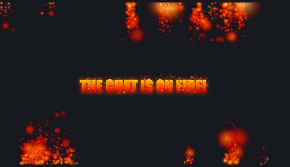

# Fire Chat Overlay Widget

A cinematic fire overlay widget for Kick streamers that brings hype moments to life.

## Features

* Chat-triggered fire effect
* Full-screen animated flames
* Custom peak message
* Adjustable fire intensity
* Cooldown protection
* Custom cooldown message
* Smooth and lightweight
* Fully customizable
* HTML, CSS and JavaScript
* OBS Browser Source compatible

## Preview



## Installation

1. Download or clone the repository.
2. Create a new widget in KickBot.
3. Copy the contents of `index.html`, `style.css`, and `script.js`.
4. Save the widget and add it as a Browser Source in OBS.

## Example Command

```text
!fire
```

Displays a cinematic fire effect with a custom message on screen.

## User Variables

### Peak Message

Custom text displayed during the fire event.

Default:

```text
CHAT ON FIRE NO CAP 🔥
```

### Fire Intensity

Controls how intense the fire particles are.

Default:

```text
80
```

### Cooldown Message

Message displayed when the command is on cooldown.

Default:

```text
🔥 whole squad is ASH rn, !fire locked for a bit
```

## Files

* `index.html`
* `style.css`
* `script.js`

## License

This project is free for personal and non-commercial use.

Commercial use, resale, modification for resale, or redistribution as a paid product is prohibited without permission.

© 2026 3EPRRR

### Author

Designed & Developed by 3EPRRR 
